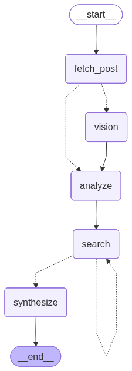

# Bluesky Post Explainer

An AI agent that takes any public Bluesky post URL and returns 3–5 bullet points that explain it — surfacing the background context, key people, and cultural significance that make the post meaningful. Think of it as an instant briefing for posts you don't fully understand.

**Example:** a post referencing the "Ralph Wiggum technique" returns bullets explaining the bash-loop coding pattern, who coined it, and why it spread — all sourced from live web search.

---

## Quick Start

### Prerequisites

- Python 3.11+
- Node.js 18+
- [OpenAI API key](https://platform.openai.com/api-keys)
- [Tavily API key](https://app.tavily.com/) (1,000 free searches/month)

### 1. Configure environment

```bash
git clone <repo-url>
cd rapidcanva
cp backend/.env.example backend/.env
# Fill in OPENAI_API_KEY and TAVILY_API_KEY
```

### 2. Start the backend

```bash
cd backend
python -m venv .venv
source .venv/bin/activate      # Windows: .venv\Scripts\activate
pip install -r requirements.txt
uvicorn main:app --reload
# → http://localhost:8000
```

### 3. Start the frontend

```bash
cd frontend
npm install
npm run dev
# → http://localhost:5173
```

Paste any Bluesky post URL and click **Explain post**.

### Environment variables

| Variable          | Required | Description                                          |
|-------------------|----------|------------------------------------------------------|
| `OPENAI_API_KEY`  | Yes      | Used for query generation, vision, and synthesis     |
| `TAVILY_API_KEY`  | Yes      | Used for web search                                  |
| `ALLOWED_ORIGINS` | No       | CORS origins (default: localhost dev ports)          |

---

## Architecture

### Stack

| Layer              | Technology                                                        |
|--------------------|-------------------------------------------------------------------|
| Frontend           | React 18, TypeScript, Vite, Tailwind CSS, TanStack Query          |
| Backend            | FastAPI, Python 3.12, LangGraph                                   |
| AI — synthesis     | GPT-4o (synthesis + vision)                                       |
| AI — support       | GPT-4o-mini (query generation, LLM-as-judge, eval conclusion)     |
| Search             | Tavily advanced search                                            |
| Eval embeddings    | `sentence-transformers` `all-MiniLM-L6-v2`                        |

### Backend

```
backend/
├── main.py               # FastAPI app, CORS, routers
├── config.py             # Pydantic settings (env vars)
├── agent/
│   ├── graph.py          # LangGraph StateGraph definition
│   ├── nodes.py          # One async function per graph node
│   ├── state.py          # AgentState TypedDict
│   └── fetchers.py       # PostFetcher protocol + BlueSkyFetcher
├── api/
│   ├── explain.py        # POST /api/v1/explain
│   ├── eval.py           # POST /api/v1/eval/run  (SSE stream)
│   └── models.py         # Pydantic request/response models
└── evaluation/
    ├── cases.json        # 12 hand-crafted test cases
    ├── eval_runner.py    # CLI harness
    ├── judge.py          # LLM-as-judge scorer
    └── metrics.py        # Embedding metrics + weighted score
```

### Frontend

```
frontend/src/
├── App.tsx                # Shell with tab navigation (Explainer / Evaluation)
├── api/                   # Typed fetch wrappers
├── hooks/useExplain.ts    # TanStack Query mutation + models query
├── types/index.ts         # Shared TypeScript types
└── components/
    ├── UrlInput.tsx        # URL input with client-side format validation
    ├── PostPreview.tsx     # Post card (avatar, text, optional image)
    ├── ExplanationCard.tsx # Numbered bullet list
    ├── SearchResultsPanel.tsx  # Collapsible sources panel
    ├── LoadingState.tsx    # Animated step-by-step progress indicator
    ├── ModelSelect.tsx     # Custom dropdown with provider icon
    └── EvalDashboard.tsx   # Live evaluation dashboard (SSE)
```

---

## Agent Architecture (LangGraph)

The agent is implemented as a directed graph using [LangGraph](https://github.com/langchain-ai/langgraph). Each node is a pure async function that receives and returns `AgentState` — a `TypedDict` holding everything the pipeline needs from start to finish.



### Nodes

| Node | Model | What it does |
|------|-------|--------------|
| `fetch_post` | — | Resolves the Bluesky handle to a DID via the AT Protocol public API, fetches the post thread, extracts text and image URL |
| `vision` | GPT-4o | Describes the image and extracts any text visible in it. Skipped automatically if there is no image. |
| `analyze` | GPT-4o-mini | Generates 2–3 precise web search queries from the post text and image context |
| `search` | — | Runs all queries in parallel via Tavily, deduplicates results by URL |
| `synthesize` | GPT-4o | Writes 3–5 bullet points grounded in the search results, returns structured JSON |

### Conditional edges

- After `fetch_post`: if the post has an image → `vision`; otherwise → `analyze` directly.
- After `search`: if fewer than 3 results were returned and the iteration count is under 2 → retry `search`; otherwise → `synthesize`.

### Extensibility: adding a new social network

All Bluesky-specific code lives in `agent/fetchers.py`. Every other node is network-agnostic — it only sees `PostData(text, author, image_url)`. To support a new platform, implement the `PostFetcher` protocol and register it:

```python
class InstagramFetcher:
    def can_handle(self, url: str) -> bool:
        return "instagram.com" in url

    async def fetch(self, url: str) -> PostData:
        ...

FETCHERS = [BlueSkyFetcher(), InstagramFetcher()]
```

Nothing else changes — not the graph, not the API, not the frontend.

---

## Evaluation Harness

The harness measures how well the agent explains posts across **12 hand-crafted cases** covering:

- Political breaking news
- Science journalism
- Sports satire and niche humor
- Tech culture references
- Niche creators and personal posts
- Ambiguous / very short posts
- Posts with no available background context

Each case includes: the live Bluesky URL, a reference explanation, relevant background context, and expected search queries.

### Running the harness

```bash
# Requires the backend running on localhost:8000
cd backend
python -m evaluation.eval_runner

# Point at a different backend
python -m evaluation.eval_runner --url http://my-server:8000

# Run with pass/fail thresholds (CI)
pytest tests/test_eval.py -v

# Unit tests only (no API keys needed)
pytest tests/unit/ -v
```

Results are printed to the terminal and written to `backend/evaluation/eval_report.json`. The **Evaluation tab** in the UI streams the same results in real time as each case completes.

### Metrics

All metrics are computed per case and averaged across active (non-skipped) cases for the aggregate report.

#### Embedding metrics (`all-MiniLM-L6-v2`)

| Metric | How it's computed | What it measures |
|--------|-------------------|-----------------|
| **Explanation similarity** | Cosine similarity between concatenated bullet texts and the reference explanation | Did the agent surface the right ideas? |
| **Context similarity** | Cosine similarity between bullets and the `relevant_context` field | Did it draw on the right background knowledge? |
| **Search query similarity** | Hungarian-matched cosine similarity between generated and expected queries, penalised by `max(N, M)` denominator | Did it search for the right things? |
| **Citation rate** | 1.0 if ≥ 1 source URL returned, else 0.0 | Did it ground its answer in sources? |
| **Bullet count** | 1.0 if count is within `[min_bullets, max_bullets]`, else 0.0 | Did it follow the output format? |

> `Context similarity` and `search query similarity` return `None` (excluded from aggregation) for cases that have no `relevant_context` or `expected_search_queries` — avoiding noise from cases where those fields don't apply.

The **Hungarian matching** for query similarity finds the optimal one-to-one pairing between generated and expected queries (maximising total cosine similarity), then divides by `max(N, M)` to penalise both over- and under-generation.

#### LLM-as-judge (`gpt-4o-mini`)

Seven metrics, each scored 1–5 with a one-sentence reason:

| Metric | What it checks |
|-----------|---------------|
| `explanation_relevance` | Bullets cover the key ideas of the reference explanation without off-topic content |
| `faithfulness` | Claims are supported by sources and post text — no hallucinations |
| `groundedness` | Each bullet anchors in concrete evidence rather than vague generalisations |
| `completeness` | No important context from `relevant_context` is missing |
| `clarity` | Clear and accessible to a general audience, not jargon-heavy |
| `context_relevance` | Retrieved web content was actually useful for explaining the post |
| `search_query_relevance` | Queries targeted the right angles (judged by intent, not exact wording) |

The judge is calibrated to be strict: 3 is the default for adequate-but-unremarkable work; 4–5 must be genuinely earned; 1–2 when the output fails its basic purpose in that dimension.

**`judge_score`** = mean of all 7 metrics scores, normalised to 0–1 (divides by 5).

#### Composite evaluation score

A single weighted mean across all metrics per case:

| Metric | Weight | Rationale |
|--------|--------|-----------|
| `bullets_explanation_similarity` | 3× | Core quality signal — did it find the right answer? |
| `judge_score` | 3× | Holistic LLM quality assessment |
| `bullets_context_similarity` | 2× | Context grounding |
| `search_query_similarity` | 1× | Search strategy quality |
| `citation` | 1× | Source attribution |
| `bullet_count` | 1× | Format compliance |

`None` values are excluded from the weighted mean so cases missing optional fields are not penalised.

#### pytest thresholds (CI)

| Metric | Pass threshold |
|--------|---------------|
| Explanation similarity | ≥ 0.55 |
| Context similarity | ≥ 0.45 |
| Search query similarity | ≥ 0.45 |
| Citation rate | ≥ 0.80 |
| Judge score | ≥ 0.50 |

---

## Design Decisions

### Tavily over OpenAI's built-in web search

OpenAI's `web_search` tool folds retrieval into generation — you get citations in the output, but the retrieved documents are invisible. This makes the search step untestable, prevents any inspection of what context the model actually saw, and removes the possibility of evaluating search quality independently. Tavily returns structured results with raw content per query, keeping every step of the pipeline observable and independently testable.

### Simple chain over agent loop

The task is precisely defined: one URL in, one explanation out. A ReAct-style loop (where the model decides whether to search again) adds unpredictable latency and testing complexity with no quality improvement here. The graph has a single conditional retry on `search` when fewer than 3 results come back, but defaults to a straight chain. Simplicity is intentional.

### LangGraph for the agent

LangGraph makes the data flow explicit and auditable. Each node is a pure async function; the transitions are declared; the graph can be visualised as a PNG. It adds negligible overhead over a raw `asyncio` chain while making the architecture easy to extend — new nodes, new conditional edges — without touching existing code.

### GPT-4o-mini for query generation and judging

Query generation and evaluation judging are cost-sensitive operations that run on every request or every eval case respectively. GPT-4o-mini performs comparably to GPT-4o on structured extraction and scoring tasks at significantly lower cost. GPT-4o is reserved for synthesis and vision, where output quality is directly user-facing.

### `response_format=json_object` on all structured calls

Eliminates prompt fragility entirely. No regex, no markdown-fence stripping, no "the model added a preamble" edge cases. Every structured output is parsed with a single `json.loads()` call.

### SSE streaming for the evaluation dashboard

Evaluation runs take 2–5 minutes across 12 cases. Returning a single JSON blob at the end would feel like a hung process. Server-Sent Events let the frontend render each case result as it completes, making the dashboard feel live without the complexity of WebSockets.

### `PostFetcher` protocol for network extensibility

Bluesky-specific logic is isolated behind a `PostFetcher` protocol in `agent/fetchers.py`. The rest of the pipeline only sees `PostData(text, author, image_url)`. Supporting a new social network is a new class and one line in the registry — zero changes elsewhere.

---

## Bonus Features

- **Image understanding** — when a post contains an image, its URL is passed to GPT-4o as a vision message (`detail: "low"` to minimise token cost). The synthesiser incorporates visual context directly into the bullet points.
- **Citations** — source URLs are returned as structured data and displayed in a collapsible panel in the UI.
- **Multi-model comparison** — any OpenAI model can be selected from the dropdown (gpt-4o, gpt-4o-mini, gpt-4-turbo, gpt-4.1, gpt-4.1-mini, o3-mini). The selected model is propagated through agent state and used for synthesis and vision, enabling direct quality comparison across models.
- **Live evaluation dashboard** — the Evaluation tab streams results case-by-case via SSE, showing embedding metrics, LLM-judge dimension scores with reasoning, generated bullets, and a full post preview per case.
- **Composite evaluation score** — a weighted metric combining all embedding and judge signals into a single 0–1 score, surfaced both per case and in aggregate.

---

## Limitations

- **No video support** — posts containing only a video return no image URL; the vision node is skipped and the agent relies entirely on post text.
- **No quote-post context** — when a post is a quote-repost, the quoted post's text is not fetched. The agent only sees the outer post.
- **No embedded link content** — external link previews (titles, thumbnails from linked articles) are not resolved. Only the post text and image are used as input.
- **No thread context** — only the target post is fetched. Parent posts and replies are ignored, even when they are essential for understanding the conversation.
- **Public posts only** — the AT Protocol public API requires no authentication but only works for public accounts. Private or blocked accounts return an error.
- **OpenAI models only** — the `PostFetcher` abstraction makes the network layer extensible, but the agent nodes are currently wired to the OpenAI SDK. Supporting Anthropic or Gemini would require parameterising the LLM client in each node.
- **Tavily free tier** — 1,000 searches/month; each explain request consumes 2–3 searches.

---

## Deployment

### Docker Compose on AWS EC2

The simplest setup: one EC2 instance, two containers (backend + nginx), no managed services needed.

```bash
# 1. Launch EC2 (Amazon Linux 2023, t3.small minimum)
#    Security group: open ports 22 (SSH) and 80 (HTTP)

# 2. Install Docker
sudo dnf install -y docker
sudo systemctl enable --now docker
sudo usermod -aG docker ec2-user

# Install Docker Compose plugin
sudo mkdir -p /usr/local/lib/docker/cli-plugins
sudo curl -SL https://github.com/docker/compose/releases/latest/download/docker-compose-linux-x86_64 \
  -o /usr/local/lib/docker/cli-plugins/docker-compose
sudo chmod +x /usr/local/lib/docker/cli-plugins/docker-compose

# 3. Clone, configure, deploy
git clone <repo-url> && cd rapidcanva
cp backend/.env.example backend/.env
nano backend/.env          # fill in API keys
docker compose up -d --build
```

The app is available at `http://<EC2-public-IP>`.

### How the containers are wired

| Container  | What it runs | Exposed externally? |
|------------|-------------|---------------------|
| `backend`  | FastAPI + Uvicorn on port 8000 | No — internal only |
| `frontend` | nginx on port 80 | Yes — public entry point |

nginx proxies all `/api/` requests to `http://backend:8000` by container name, and serves the React SPA for everything else. The backend is never directly reachable from the internet.

### Scaling up

When traffic grows, the natural next step is **AWS ECS Fargate**: replace the EC2 with a task definition per service, add an Application Load Balancer, and let ECS handle instance management. The same Docker images work without modification.

---

## Next Steps

- **HTTPS** — add TLS via Let's Encrypt/Certbot or AWS ACM behind an ALB. The current setup serves plain HTTP.
- **Multi-provider LLM support** — parameterise the LLM client in each agent node to support Anthropic Claude or Google Gemini, enabling real multi-provider quality comparison.
- **Thread and quote-post context** — fetch parent and quoted posts to give the agent full conversational context when it matters.
- **Streaming explanation output** — stream the synthesiser's token output to the frontend so bullets appear progressively rather than all at once.
- **Result caching** — cache post fetches and search results by URL to avoid redundant API calls when the same post is explained more than once.
- **More social networks** — the `PostFetcher` protocol is already in place; adding Twitter/X, Mastodon, or Threads is one new class and one line in the registry.
- **Parallel evaluation** — run eval cases concurrently instead of sequentially to reduce evaluation time from ~5 minutes to under one minute.
